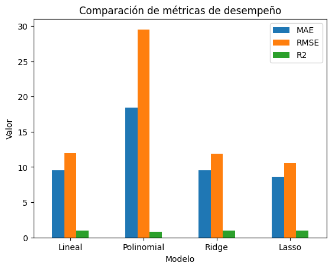
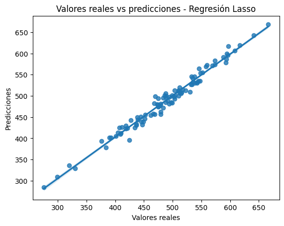

# Predicción de Gasto en Clientes E-commerce

## 📌 Problema
La empresa busca personalizar estrategias de marketing prediciendo el gasto esperado de sus clientes.

## 🎯 Objetivo
Desarrollar un modelo de regresión supervisada capaz de estimar el monto de compra a partir de variables demográficas y de comportamiento.

## 📊 Datos
Dataset con información de clientes, incluyendo:
- Edad  
- Comportamiento en el sitio web  
- Variables demográficas  
- Historial de compras  

## ⚙️ Metodología
- Limpieza y preparación de datos  
- Codificación de variables categóricas  
- Escalamiento de variables  
- División en entrenamiento y prueba  
- Entrenamiento de modelos de regresión (lineal, polinomial)  
- Validación cruzada  
- Optimización con GridSearchCV  
- Implementación de modelos avanzados (Gradient Boosting)  

## 📈 Resultados
- Comparación de modelos predictivos  
- Mejora del rendimiento mediante ajuste de hiperparámetros  
- Selección de un modelo final con mejor desempeño  

## 🚀 Tecnologías
Python, Pandas, Scikit-learn, Statsmodels

## 📊 Resultados gráficos
### 🔹 Comparación de modelos

Se evaluaron distintos modelos de regresión utilizando métricas como MAE, RMSE y R² para identificar la mejor alternativa.

📌 Insight: Los modelos optimizados presentan un mejor desempeño, destacando Lasso como la opción más equilibrada en términos de precisión y generalización.

### 🔹 Predicción vs valores reales (Modelo Lasso)

El modelo Lasso presenta una buena capacidad de ajuste, logrando aproximarse a los valores reales del gasto de los clientes.

📌 Insight: El modelo captura adecuadamente el comportamiento general del gasto, manteniendo un buen equilibrio entre precisión y capacidad de generalización.

## 🧠 Modelo final seleccionado

El modelo Lasso fue seleccionado como modelo final debido a su buen desempeño en métricas de evaluación y su capacidad de generalización, evitando el sobreajuste mediante regularización.
