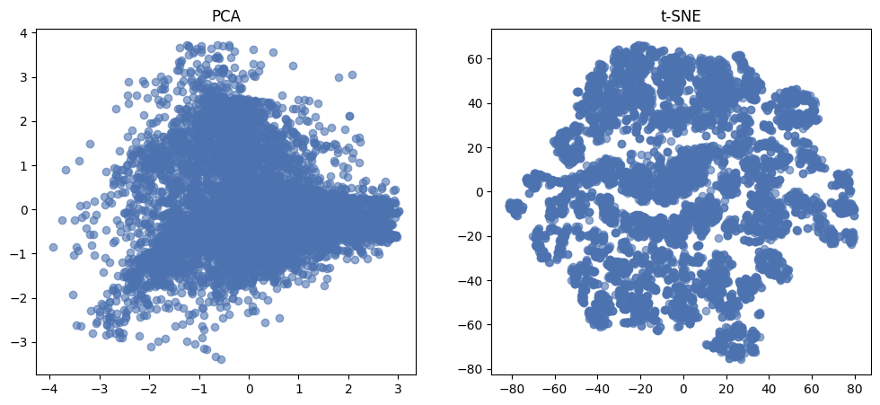
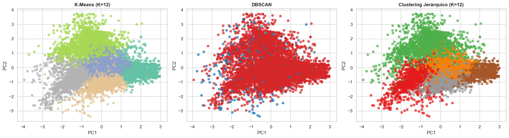
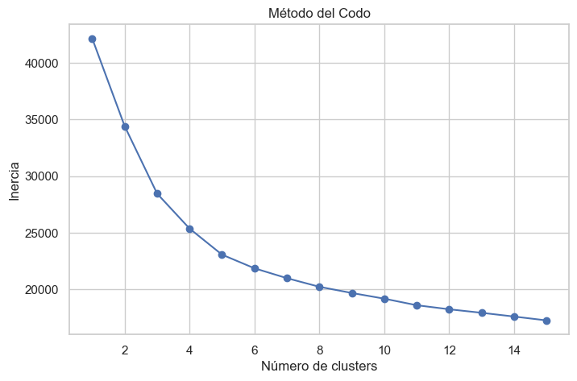
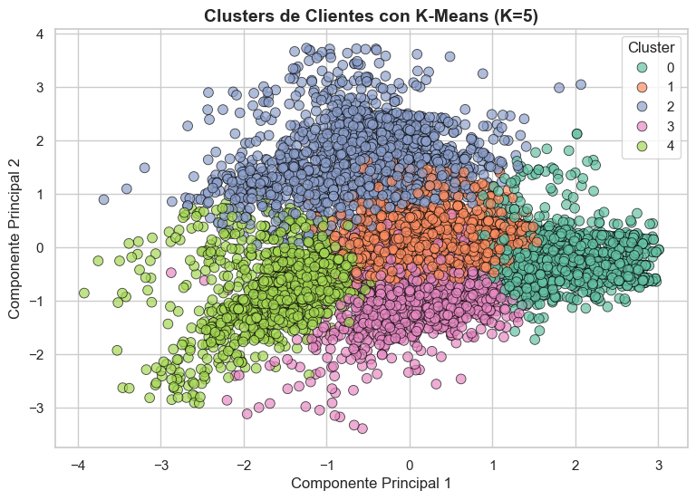

# Segmentación de Clientes en Retail

## 📌 Problema
La empresa busca identificar segmentos de clientes para mejorar la personalización de campañas de marketing y estrategias comerciales.

## 🎯 Objetivo
Aplicar técnicas de aprendizaje no supervisado para identificar grupos de clientes con comportamientos similares a partir de datos no etiquetados.

## 📊 Datos
Dataset de clientes con variables de comportamiento y características demográficas.

## ⚙️ Metodología
- Limpieza y normalización de datos  
- Reducción dimensional (PCA, t-SNE)  
- Aplicación de algoritmos de clustering (K-Means, DBSCAN, jerárquico)  
- Evaluación de clusters (método del codo, coeficiente de silueta)  
- Visualización de resultados  

## 📈 Resultados
- Identificación de segmentos de clientes con características diferenciadas  
- Comparación de algoritmos de clustering  
- Selección de un modelo de segmentación interpretable y útil para el negocio  

## 🚀 Tecnologías
Python, Pandas, Scikit-learn, PCA, t-SNE

## 📊 Resultados gráficos
### 🔹 Visualización en espacio reducido (PCA / t-SNE)

La reducción dimensional permite representar los datos en un espacio bidimensional, facilitando la identificación de patrones y posibles agrupaciones.

📌 Insight: PCA no muestra una separación clara de los datos, mientras que t-SNE revela agrupamientos más definidos, siendo más útil para identificar segmentos, aunque con menor interpretabilidad.

### 🔹 Comparación de algoritmos de clustering

Se compararon distintos algoritmos de clustering (K-Means, DBSCAN y agrupamiento jerárquico) para evaluar su capacidad de segmentación.

📌 Insight: Existen diferencias en la forma en que cada algoritmo agrupa los datos, destacando K-Means por su claridad e interpretabilidad.

### 🔹 Determinación del número óptimo de clusters

El método del codo permite identificar el número óptimo de clusters en K-Means mediante la evaluación de la variación interna.

📌 Insight: Se observa un punto de inflexión que sugiere una segmentación adecuada del dataset.

### 🔹 Segmentación final de clientes (K-Means)

El modelo K-Means permite identificar grupos de clientes con comportamientos diferenciados.

📌 Insight: La segmentación revela perfiles de clientes con distintas dinámicas de compra, lo que permite diseñar estrategias de marketing más específicas y efectivas.

## 🧠 Modelo de segmentación seleccionado

El modelo K-Means fue seleccionado debido a su capacidad para generar clusters claros, interpretables y útiles desde una perspectiva de negocio.
