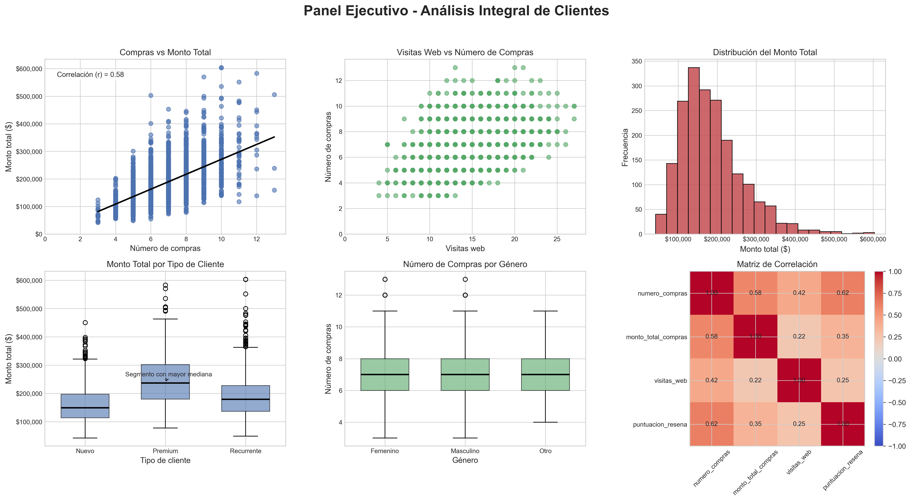
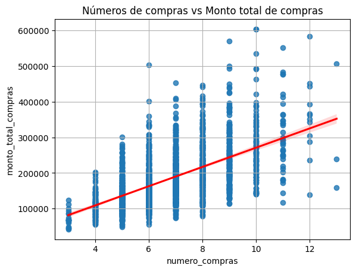
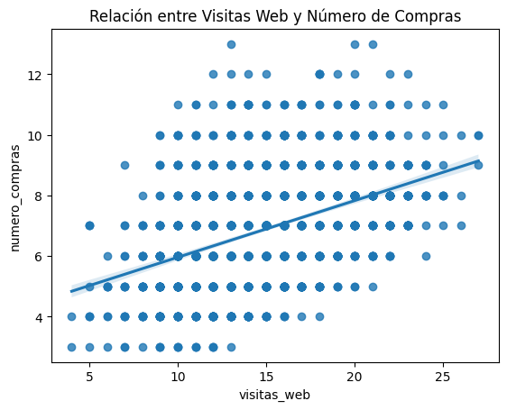
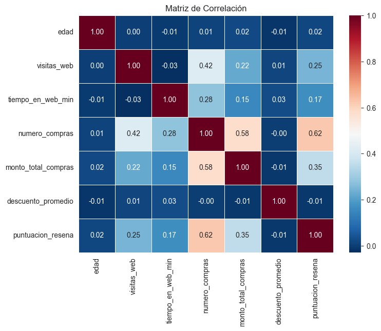

# Análisis Exploratorio de Datos para Decisiones Comerciales

## 📌 Problema
Una empresa de e-commerce necesita comprender el comportamiento de sus clientes para mejorar sus decisiones comerciales y de marketing.

## 🎯 Objetivo
Analizar un conjunto de datos de clientes para identificar patrones, relaciones entre variables y oportunidades de mejora mediante técnicas de análisis exploratorio de datos (EDA).

## 📊 Datos
El dataset incluye información sobre:
- Compras
- Visitas
- Montos de gasto
- Devoluciones
- Reseñas de clientes

## ⚙️ Metodología
- Limpieza y exploración inicial de datos  
- Análisis de variables categóricas y numéricas  
- Cálculo de estadísticas descriptivas  
- Detección de valores atípicos  
- Análisis de correlaciones  
- Implementación de modelos de regresión lineal  
- Visualización de datos con Seaborn y Matplotlib  

## 📈 Resultados
- Identificación de patrones de comportamiento de clientes  
- Detección de variables relevantes para el negocio  
- Generación de insights que pueden apoyar decisiones estratégicas  

## 🚀 Tecnologías utilizadas
Python, Pandas, Seaborn, Matplotlib, Statsmodels

## 📊 Resultados gráficos
## 📊 Panel Ejecutivo – Análisis Integral de Clientes

Este panel resume los principales hallazgos del análisis exploratorio, integrando visualizaciones clave para comprender el comportamiento de los clientes y su impacto en el negocio.

Se analizan patrones de compra, conversión digital, segmentación de clientes y relaciones entre variables, permitiendo construir una visión global basada en datos.

🔎 **Insight clave:** El comportamiento de compra está influenciado tanto por la frecuencia como por el monto gastado, evidenciando distintos perfiles de clientes.

### 🔹 Relación entre número de compras y monto total

.

Se observa una relación positiva entre la frecuencia de compra y el gasto total, lo que indica que clientes más activos tienden a generar mayor valor.

📌 Este análisis permite identificar perfiles de alto valor y posibles estrategias de fidelización.

### 🔹 Relación entre visitas web y número de compras

.

El análisis muestra cómo el tráfico web se relaciona con la conversión en compras, permitiendo evaluar la efectividad del canal digital.

📌 Insight: La interacción digital (visitas) influye en las compras de forma indirecta, aumentando la frecuencia de compra más que el gasto total, lo que posiciona al número de compras como una variable clave en la conversión.

### 🔹 Matriz de correlación

.

La matriz de correlación permite identificar relaciones relevantes entre variables clave del negocio.

📌 Insight: Existen variables fuertemente asociadas que pueden ser utilizadas en futuros modelos predictivos.
